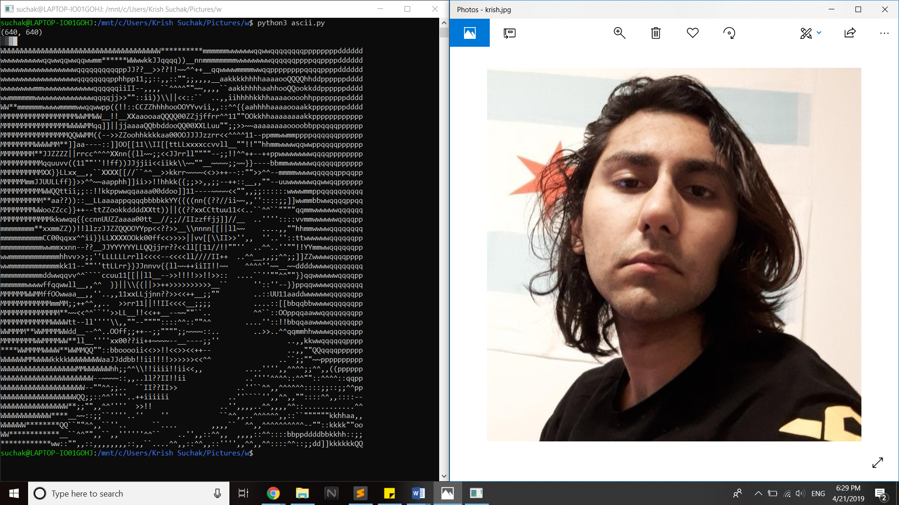

# vid2ascii

## Application to convert videos to ASCII text.

### Initial results to convert picture to ASCII

alphabetic char            |  special char
:-------------------------:|:-------------------------:
              |  

### TODO:
- read in terminal size and use
- 2d array of pixels
- formalize functions
- video to images
- gui
- website
