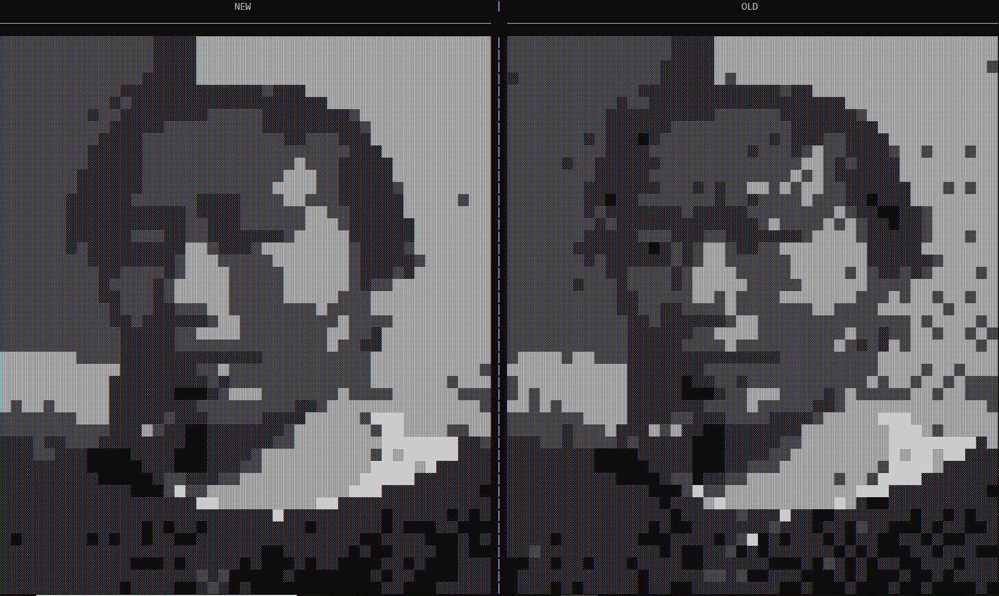

# lofi_+__vid2ascii_

## Application to convert videos to ASCII text.

### Initial results to convert picture to ASCII

alphabetic char            |  special char
:-------------------------:|:-------------------------:
              |  

### Cleaning image using better pixel brightness polling algorithm (left)

### TODO:
- preprocess frames / autocontrast 
- read in terminal size and use
- video to images
- gui
- website
