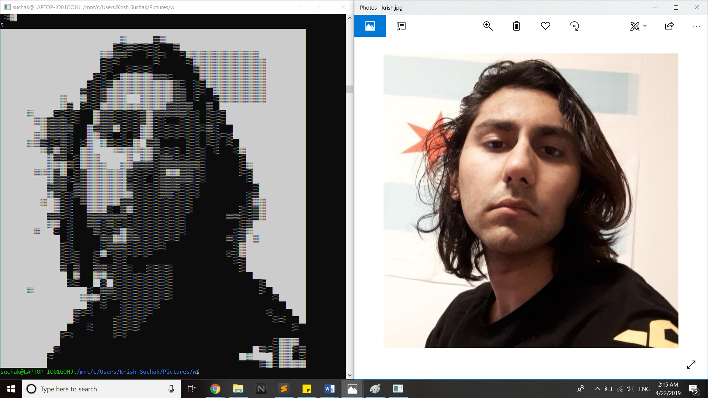

# retro

## Application to convert videos to ASCII text.

### Initial results to convert picture to ASCII

alphabetic char            |  special char
:-------------------------:|:-------------------------:
              |  

### Cleaning image using better pixel brightness polling algorithm (left)

### Sharpening image beforehand using autocontrast algorithm (left)

### TODO:
- ~~picture to ascii~~
- ~~convert pixel area to char~~
- ~~preprocess frames / autocontrast~~
- multiprocessing
- read in terminal size and use
- video to images
- gui
- website
